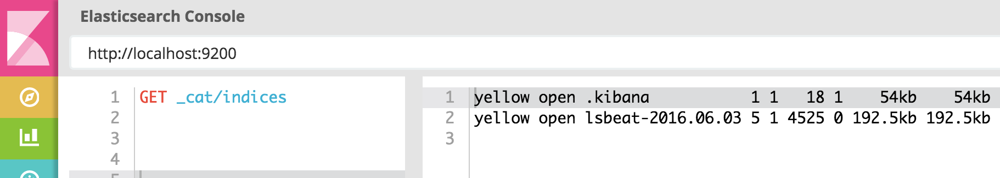
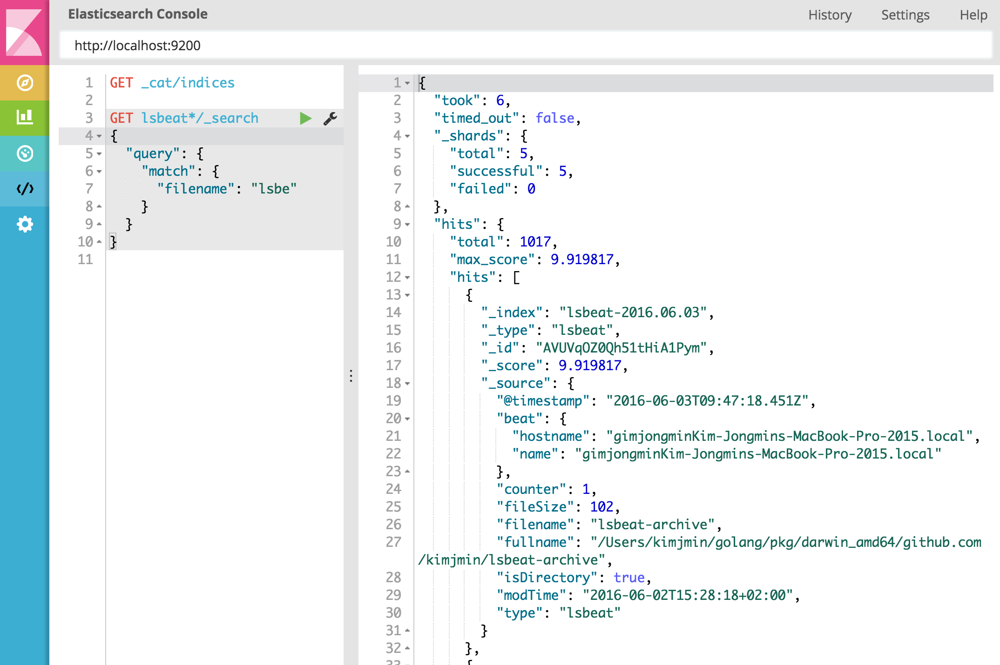

# Create your own beat

Beats is the platform for building lightweight, open source data shippers for many types of data for Elasticsearch and Logstash. We are providing kinds of beats like Libbeat, Packetbeat, Filebeat and Metricbeat and also there are [Community Beats](https://www.elastic.co/guide/en/beats/libbeat/current/community-beats.html) made by beats community.

We provide a libbeat library and Beat Generator package that helps you to create your own beat. Today we will see how to create you own beat by using Beat Generator. The Beat that we create today for practice is `lsbeat`. lsbeat indexes informations of files and directories that lists with Unix command `ls`. This article is based with Unix OS, so if you are Windows or other OS user, follow informations which fits with your OS.


## Step 1 - Setup your Golang Environment

Beats are written in Golang. To create and develop a beat, Golang must be installed on your machine. Follow the guide here to [install Golang](https://golang.org/doc/install). Currently Beats require at least Golang 1.6. Make sure properly setup your `$GOPATH` variable. 

In addition to Golang Glide is used for the dependency management. Make sure to install at least Glide 0.10.0 from this guide [here](https://github.com/Masterminds/glide). We will need glide later.

By the way, let's see the code that we will use for lsbeat. This is simple golang program that lists all directories and files under itself and subdirectories of its runtime argument.

```go
package main

import (
	"fmt"
	"io/ioutil"
	"os"
)

func main() {
	//apply run path "." without argument.
	if len(os.Args) == 1 {
		listDir(".")
	} else {
		listDir(os.Args[1])
	}
}

func listDir(dirFile string) {
	files, _ := ioutil.ReadDir(dirFile)
	for _, f := range files {
		t := f.ModTime()
		fmt.Println(f.Name(), dirFile+"/"+f.Name(), f.IsDir(), t, f.Size())
    
		if f.IsDir() {
			listDir(dirFile + "/" + f.Name())
		}
	}
}
```

We will reuse the code of `listDir` function.

## Step 2 - Generate

To generate your own beat we use the beat-generator. First you must install `cookiecutter`. Check out the installations guides [here](http://cookiecutter.readthedocs.org/en/latest/installation.html). After having installed cookiecutter, we must decide for a name of our beat. The name must be one word all lower case. In our example which is `lsbeat`.

To create beat skeleton, you should download Beats Generator package, which included in `github.com/elastic/beats` repository. Once you installed GoLang, you can download it with using command `go get`. Once you run the command, all source files will be downloaded under `$GOPATH/src` path.
```sh
$ go get github.com/elastic/beats
```

Now created and move to your own repository under GOPATH, and run `cookiecutter` with Beat Generator path.
```sh
$ cd $GOPATH/src/github.com/{user}
$ cookiecutter $GOPATH/src/github.com/elastic/beats/generate/beat
```
Cookiecutter will ask you several questions. For your project_name enter `lsbeat`, for github_user - `your github id`. The next two question with for beat and beat_path should already be automatically set correct. For the last one your can insert your `Firstname Lastname`.
```sh
project_name [Examplebeat]: lsbeat
github_name [your-github-name]: {user}
beat [lsbeat]:
beat_path [github.com/{github id}]:
full_name [Firstname Lastname]: {Full Name}
```

This should now have created a directory `lsbeat` inside our folder with several files. Lets change to this directory and list up files automatically created.

```sh
$ cd lsbeat
$ tree
.
├── CONTRIBUTING.md
├── LICENSE
├── Makefile
├── README.md
├── beater
│   └── lsbeat.go
├── config
│   ├── config.go
│   └── config_test.go
├── dev-tools
│   └── packer
│       ├── Makefile
│       ├── beats
│       │   └── lsbeat.yml
│       └── version.yml
├── docs
│   └── index.asciidoc
├── etc
│   ├── beat.yml
│   └── fields.yml
├── glide.yaml
├── lsbeat.template.json
├── main.go
├── main_test.go
└── tests
    └── system
        ├── config
        │   └── lsbeat.yml.j2
        ├── lsbeat.py
        ├── requirements.txt
        └── test_base.py
```

We now have a raw template of our beat but still need to fetch the dependencies and setup our git repository.

```sh
$ make init
```
This command fetches the dependencies, which in our case is libbeat, creates the basic config and template files and starts a new git repository. We will have a closer look at the template and config files later. Make init can take some time to download libbeat.

After init is completed, we create the first commits of our repository with:

```sh
$ make commit
```

It will create a clean git history for each major step. Note that you can always rewrite the history if you wish before pushing your changes. From now on you can use all the normal git commands you are used to. To push `lsbeat` in the git repository, run the following commands:

```sh
$ git remote set-url origin https://github.com/{user}/lsbeat
$ git push origin master
```

Now we have a complete beat and pushed the first to Github. Lets build and run our beat and then dig deeper into the code.

## Step 3 - Set Configurations

Once you run commands above, it will create `lsbeat.yml`, `lsbeat.template.json` config files automatically. All basic configurations are already written in these files.

> lsbeat.yml

```yml
lsbeat:
  # Defines how often an event is sent to the output
  period: 1s
```

`period` is common parameter that included in all kind of beats. It represents that lsbeat iterates the process every 1 second. Let's change this period from 1 to 10 sec and add new `path` parameter which represents the path of top directory program will scan. We can add parameter in `beat.yml` under `etc` directory. Once we added new parameters, we run `make update` command to apply changes to config files.
```yml
lsbeat:
  # Defines how often an event is sent to the output
  period: 10s
  path: "."
```

Lets run `make update` and check `lsbeat.yml` again. We can see the new parameter we set on `etc/beat.yml` is applied on lsbeat.yml
```sh
$ make update
$ cat lsbeat.yml
################### Lsbeat Configuration Example #########################

############################# Lsbeat ######################################

lsbeat:
  # Defines how often an event is sent to the output
  period: 10s
  path: "."
###############################################################################
```

After changing yml files, you should edit `config/config.go` so we can use new parameters.

```go
package config

type Config struct {
        Lsbeat LsbeatConfig
}

type LsbeatConfig struct {
        Period string `config:"period"`
        Path   string `config:"path"`
}
```

## Step 4 - Basic file structure

Once you check `/vendor/elastic/beats/libbeat/beat/beat.go` file, you can find interfaces which should be implemented in your beat program.
```go
type Beater interface {
	Config(*Beat) error  // Read and validate configuration.
	Setup(*Beat) error   // Initialize the Beat.
	Run(*Beat) error     // The main event loop. This method should block until signalled to stop by an invocation of the Stop() method.
	Cleanup(*Beat) error // Cleanup is invoked to perform any final clean-up prior to exiting.
	Stop()               // Stop is invoked to signal that the Run method should finish its execution. It will be invoked at most once.
}
```

These `Config`, `Setup`, `Run`, `Cleanup`, `Stop` 5 interfaces are essential routine that Beat processes in common. These functions are implemented in `beater/lsbeat.go` file.

In top of `lsbeat.go` file, there is a struct named `Lsbeat`, which contains global variables. You have to add a parameter variable under this struct. Lets add `path` the parameter we created, and `lastIndexTime` which we will use for saving last timestamp data.
```go
type Lsbeat struct {
	beatConfig   *config.Config
	done         chan struct{}
	period       time.Duration
	client       publisher.Client
	path         string    //root directory
	lasIndexTime time.Time //last timestamp
}
```

## Step 5 - Add codes

Lets move to `Setup` function to initialize values we created. Set "10s" for init value on variable `period`.
```go
func (bt *Lsbeat) Setup(b *beat.Beat) error {

	// Setting default period if not set
	if bt.beatConfig.Lsbeat.Period == "" {
		bt.beatConfig.Lsbeat.Period = "10s"
	}
  
  // path 값을 lsbeat.yml 에 설정된 값으로 설정.
	if bt.beatConfig.Lsbeat.Path == "" {
		bt.beatConfig.Lsbeat.Path = "."
	}
	bt.path = bt.beatConfig.Lsbeat.Path
  
	bt.client = b.Publisher.Connect()

	var err error
	bt.period, err = time.ParseDuration(bt.beatConfig.Lsbeat.Period)
	if err != nil {
		return err
	}

	return nil
}
```

Now, lets move to `Run` function which is the most important.
```go
func (bt *Lsbeat) Run(b *beat.Beat) error {
	logp.Info("lsbeat is running! Hit CTRL-C to stop it.")

	ticker := time.NewTicker(bt.period)
	counter := 1
	for {
		select {
		case <-bt.done:
			return nil
		case <-ticker.C:
		}

		event := common.MapStr{
			"@timestamp": common.Time(time.Now()),
			"type":       b.Name,
			"counter":    counter,
		}
		bt.client.PublishEvent(event)
		logp.Info("Event sent")
		counter++
	}
}
```

`event := common.MapStr{}` code on `Run` function is the code that stores json document format, and `bt.client.PublishEvent(event)` code is the code that transfers data to elasticsearch. By now, there are three fields in the document, which is `@timestamp`, `type` and `counter`. In this code we will add the values of files and directories informations that we collected. 

Before we modify Run function, lets add `listDir()` function on the bottom of `lsbeat.go` file first, which collect files and directories informations. This function's arguments will be `bt *Lsbeat`, `b *beat.Beat`, `counter int`. And add next 5 fields in event MapStr variable.
- `modTime`: f.ModTime()
- `filename`: f.Name()
- `fullname`: dirFile + "/" + f.Name()
- `isDirectory`: f.IsDir()
- `fileSize`: f.Size()

It will index all files and directories for the first time, but after first routine it will check if file or directory is created or modified after first routine, to index only newer files and directories. Timestamp of last routine will be saved in `lasIndexTime` variable.

```go
//Collect files and directories informations and transfers to elasticsearch.
func listDir(dirFile string, bt *Lsbeat, b *beat.Beat, counter int) {
	files, _ := ioutil.ReadDir(dirFile)
	for _, f := range files {
		t := f.ModTime()

		event := common.MapStr{
			"@timestamp":  common.Time(time.Now()),
			"type":        b.Name,
			"counter":     counter,
			"modTime":     t,
			"filename":    f.Name(),
			"fullname":    dirFile + "/" + f.Name(),
			"isDirectory": f.IsDir(),
			"fileSize":    f.Size(),
		}
		//index all files and directories on first routine
		if counter == 1 {
			bt.client.PublishEvent(event)
		} else {
			//from 2nd routine, index only new created or modified files and directories.
			if t.After(bt.lasIndexTime) {
				bt.client.PublishEvent(event)
			}
		}

		if f.IsDir() {
			listDir(dirFile+"/"+f.Name(), bt, b, counter)
		}
	}
}
```

And don't forget to add `"io/ioutil"` package at import libraries.
```go
import (
	"fmt"
	"io/ioutil"
	"time"
```  

Now, comment (erase) index code on `Run` function and add a code to call `listDir` and save timestamp in `lasIndexTime` variable.
```go
func (bt *Lsbeat) Run(b *beat.Beat) error {
	logp.Info("lsbeat is running! Hit CTRL-C to stop it.")

	ticker := time.NewTicker(bt.period)
	counter := 1
	for {
		listDir(bt.path, bt, b, counter) // call lsbeat
		bt.lasIndexTime = time.Now()     // save timestamp

		select {
		case <-bt.done:
			return nil
		case <-ticker.C:
		}
		
		// event := common.MapStr{
		// 	"@timestamp": common.Time(time.Now()),
		// 	"type":       b.Name,
		// 	"counter":    counter,
		// }
		// bt.client.PublishEvent(event)

		logp.Info("Event sent")
		counter++
	}
}
```

We are almost done with coding. We have to add new fields on mapping. Add files informations on `etc/fields.yml` file.
```yml
- key: lsbeat
  title: LS Beat
  descrtiption: 
  fields:
    - name: counter
      type: integer
      required: true
      description: >
        PLEASE UPDATE DOCUMENTATION
    #new fiels added lsbeat
    - name: modTime
      type: date
    - name: filename
      type: text
    - name: fullname
    - name: isDirectory
      type: boolean
    - name: fileSize
      type: long
```

And apply new updates.
```sh
$ make update
```

`filename` field will be analyed with nGram tokenizer. Lets add an custom analyzer on `lsbeat.template.json` file, under "settings".
```json
{
  "mappings": {
		...
  },
  "order": 0,
  "settings": {
    "index.refresh_interval": "5s",
    "analysis": {
      "analyzer": {
        "ls_ngram_analyzer": {
          "tokenizer": "ls_ngram_tokenizer"
        }
      },
      "tokenizer": {
        "ls_ngram_tokenizer": {
          "type": "ngram",
          "min_gram": "2",
          "token_chars": [
            "letter",
            "digit"
          ]
        }
      }
    }
  },
  "template": "lsbeat-*"
}
```

## Step 6 - Build and run

Now we can build and run. Just run `make` command and it will compile codes and will build lsbeat (lsbeat.exe on windows) runnable binary file.
```sh
$ make
```

Modify `lsbeat.yml` file to set root directory for listing the files. In our case, we will set $GOPATH which is "/Users/ec2-user/go". Make sure you put full path of directory.
```yml
lsbeat:
  # Defines how often an event is sent to the output
  period: 10s
  path: "/Users/ec2-user/go"
```

And also make sure your elasticsearch and kibana is running. Lets run lsbeat and see whats happenning.
```sh
$ ./lsbeat
```

You can use `_cat` api to check if index is created and datas are indexed properly.


we can see **lsbeat-2016.06.03** index and can see count of documents. Lets query lsbeat with filename field, which analyzed with nGram tokenizer. Queried with `lsbe` keyword.


It works! congratulation, you just build your own beat.
